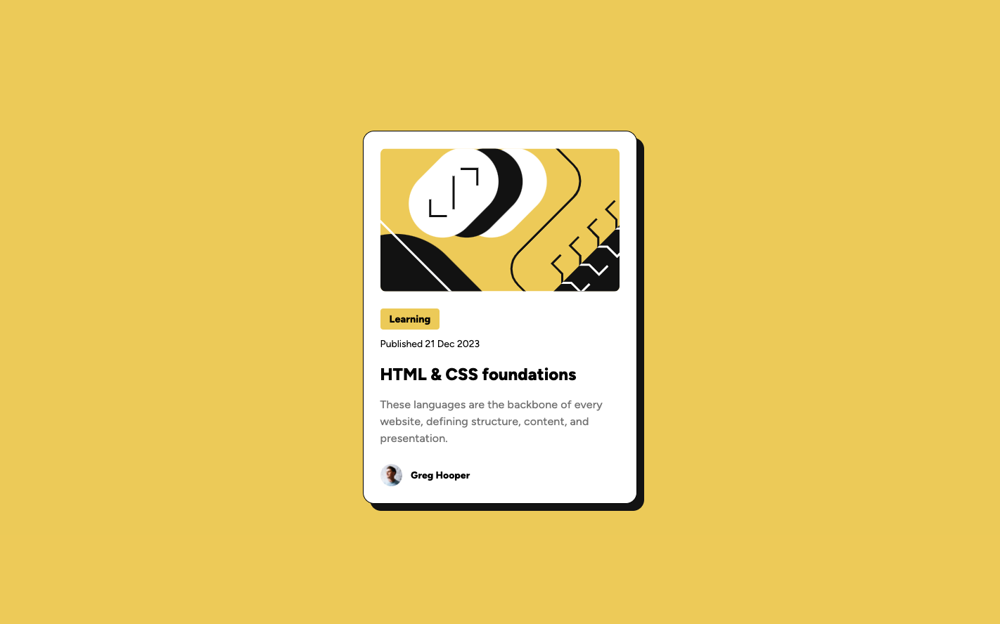

## Table of contents

- [Overview](#overview)
  - [The challenge](#the-challenge)
  - [Screenshot](#screenshot)
  - [Links](#links)
- [My process](#my-process)
  - [Built with](#built-with)
  - [What I learned](#what-i-learned)
  - [Continued development](#continued-development)
- [Author](#author)

## Overview

Blog preview card

### The challenge

Users should be able to:

- See hover and focus states for all interactive elements on the page

### Screenshot



### Links

- Live Site URL: [Blog preview card](https://65ec948bea89e0c34e5eb714--golden-kangaroo-9d3ee7.netlify.app/)

## My process

- HTML base layout
- basic CSS
- add hover state
- add media query for mobile responsiveness

### Built with

- Semantic HTML5 markup
- CSS
- Flexbox

### What I learned

- how to add font in CSS
- how to ease transition
- learned you can set the width to fit-content wow

```css
@font-face {
  font-family: Figtree;
  src: url(./assets/fonts/Figtree-VariableFont_wght.ttf);
}

.white-box {
  box-shadow: 10px 10px hsl(0, 0%, 7%);
  transition: box-shadow 0.3s ease;
}

.white-box:hover {
  box-shadow: 16px 16px hsl(0, 0%, 7%);
}

.tag {
  width: fit-content;
}
```

### Continued development

- want to learn how to mask images and make the mask grow or shrink depending on screen size
- would like to see if it's possible to only trigger the hover state of the box-shadow when hovering over the h2 link

## Author

- Website - [Danielle Sum](https://daniellesum.wordpress.com/)
- Frontend Mentor - [@danilscodes](https://www.frontendmentor.io/profile/danilscodes)
- LinkedIn - [Danielle Sum](https://www.linkedin.com/in/danielle-sum/)
